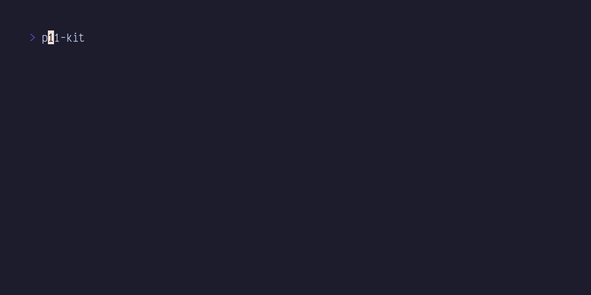

# permbits

:: en

A small CLI tool to explain UNIX permissions by giving an octal representation of the permission number

:: fr 

Un petit outil en ligne de commande pour expliquer les permissions UNIX en donnant une représentation octale du numéro de permission

